# Cookie Session Auth Example

## Mô tả
Đây là dự án Node.js sử dụng Express, MongoDB, session và cookie để xác thực người dùng.

## Cài đặt
1. Clone hoặc tải về dự án.
2. Chạy lệnh cài đặt các package:
   ```powershell
   npm install
   ```
3. Đảm bảo MongoDB đang chạy ở địa chỉ `mongodb://127.0.0.1:27017/sessionAuth`.
4. Khởi động server:
   ```powershell
   node app.js
   ```

## API và chức năng

### 1. Đăng ký tài khoản
- **URL:** `POST /auth/register`
- **Body:**
  ```json
  { "username": "admin", "password": "12345" }
  ```
- **Kết quả thành công:**
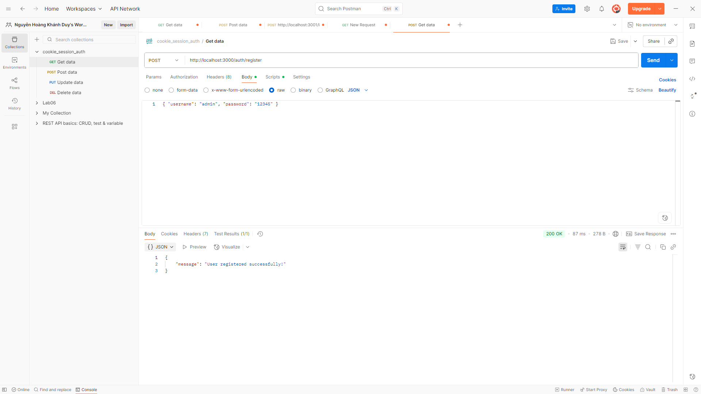
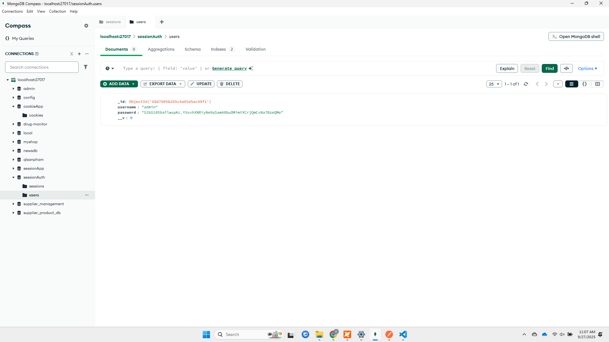
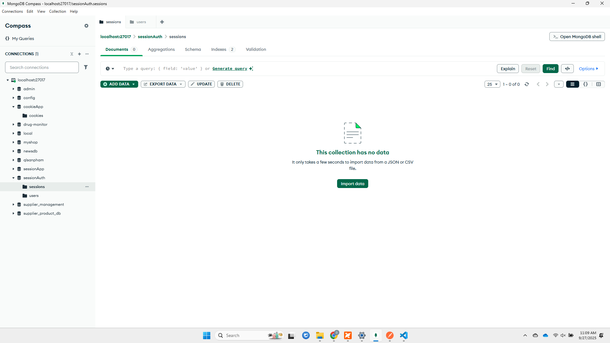
  ```json
  { "message": "User registered successfully!" }
  
  ```
- **Lỗi:**
  - Username đã tồn tại hoặc thiếu trường dữ liệu
  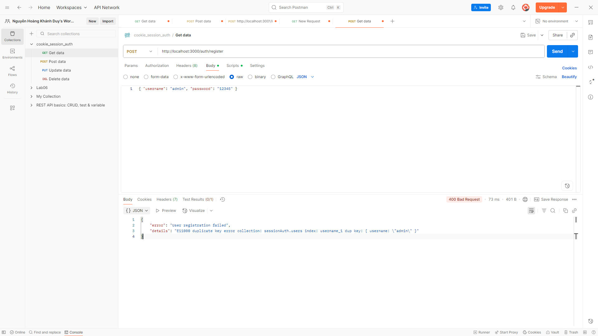
  - Trả về:
    ```json
    { "error": "User registration failed", "details": "E11000 duplicate key error collection: sessionAuth.users index: username_1 dup key: { username: \"admin\" }" }
    ```

### 2. Đăng nhập
- **URL:** `POST /auth/login`
- **Body:**
  ```json
  { "username": "admin", "password": "12345" }
  ```
- **Kết quả thành công:**
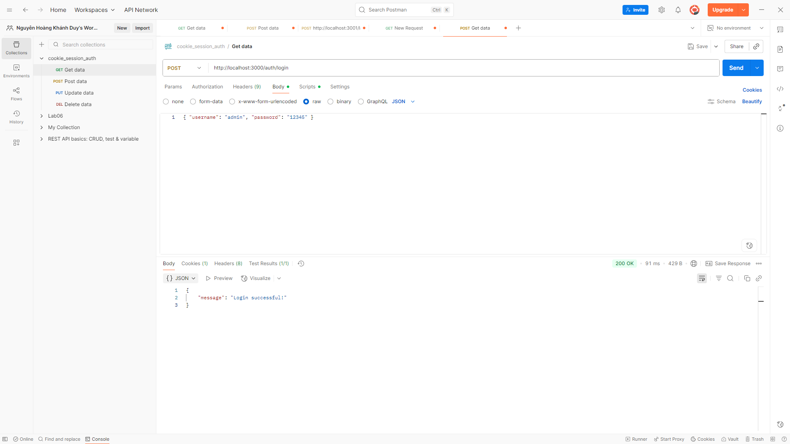
  ```json
  { "message": "Login successful!" }
  ```
  - Cookie `connect.sid` được trả về để xác thực phiên đăng nhập.
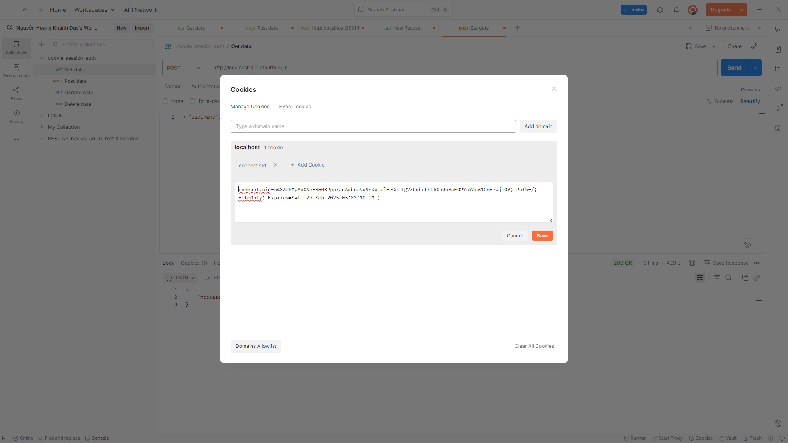
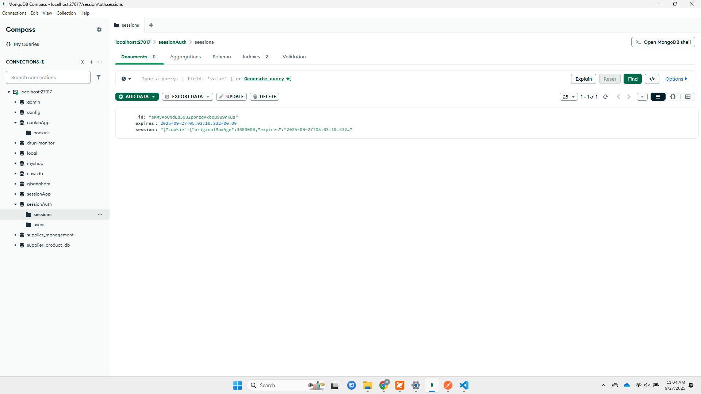

- **Lỗi:**
  - Sai username hoặc password
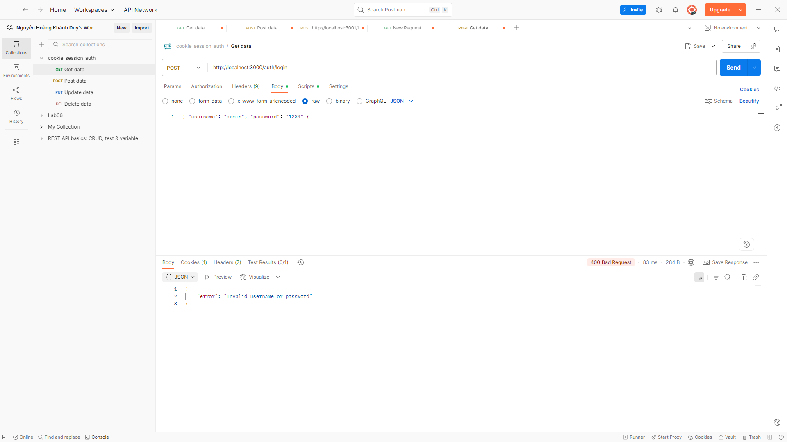
  - Trả về:
  "Invalid username or password" 
  - Không ghi nhận được dữ liệu hệ thống báo lỗi
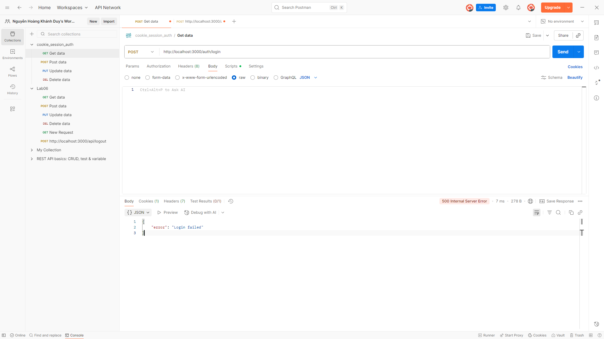
  - Trả về: 
  "Login failed" 
### 3. Xem thông tin cá nhân (Profile)
- **URL:** `GET /auth/profile`
- **Yêu cầu:** Đã đăng nhập (gửi kèm cookie `connect.sid`)
- **Kết quả thành công:**
  - Trả về thông tin user (không có password)
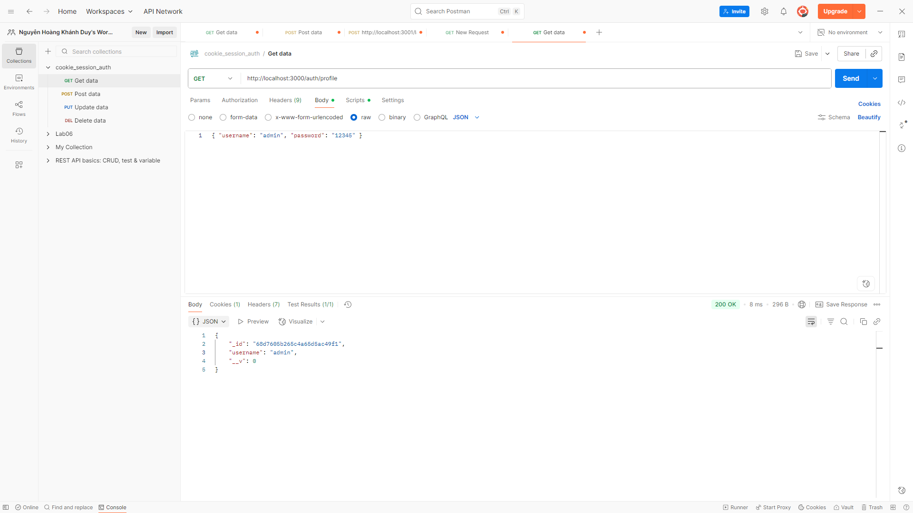
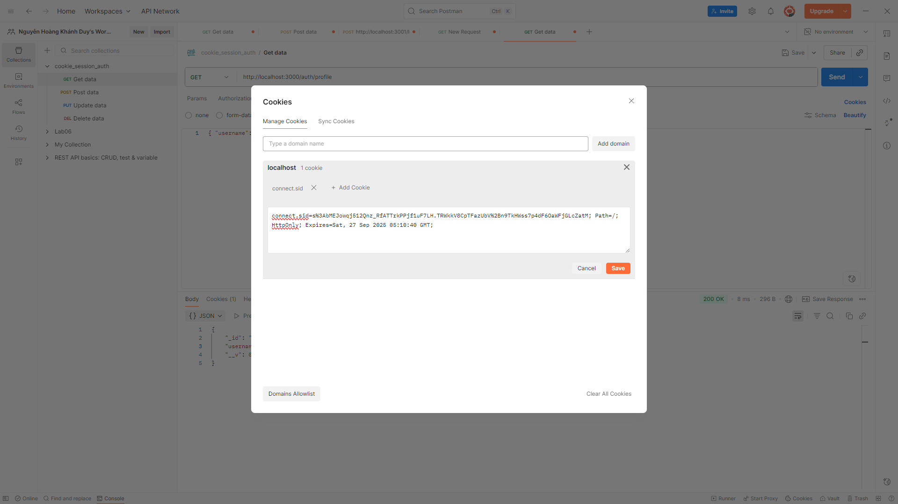
- **Lỗi:**
  - Chưa đăng nhập hoặc session hết hạn
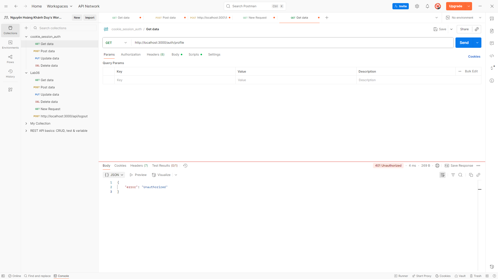
  - Trả về: 
  "Unauthorized" 
### 4. Đăng xuất
- **URL:** `GET /auth/logout`
- **Yêu cầu:** Đã đăng nhập (gửi kèm cookie `connect.sid`)
- **Kết quả thành công:**
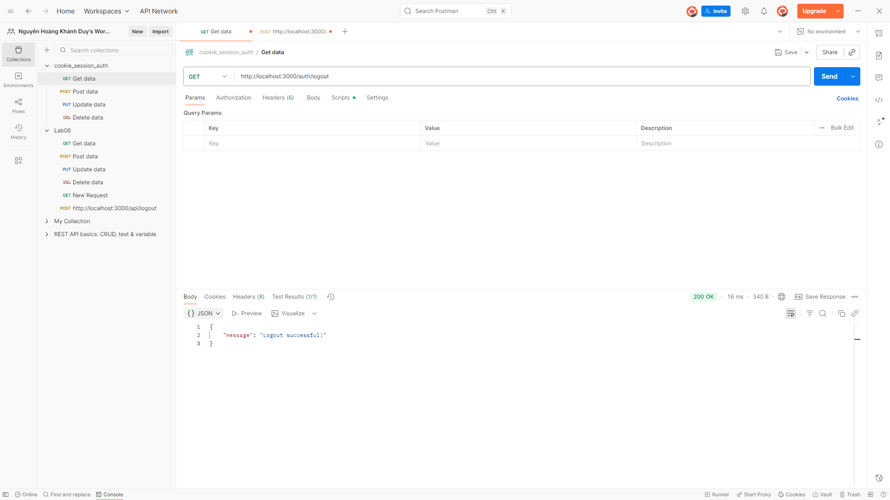
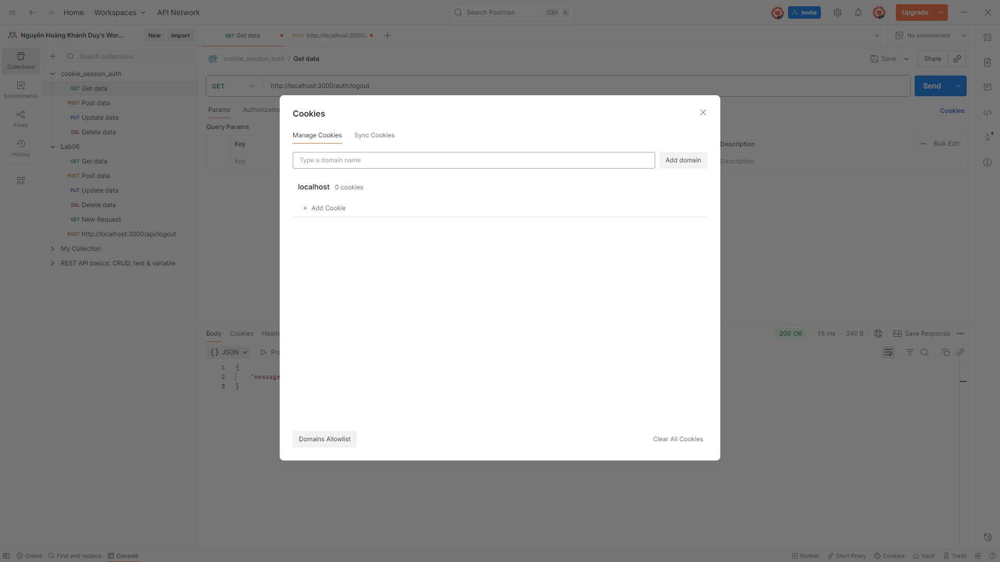
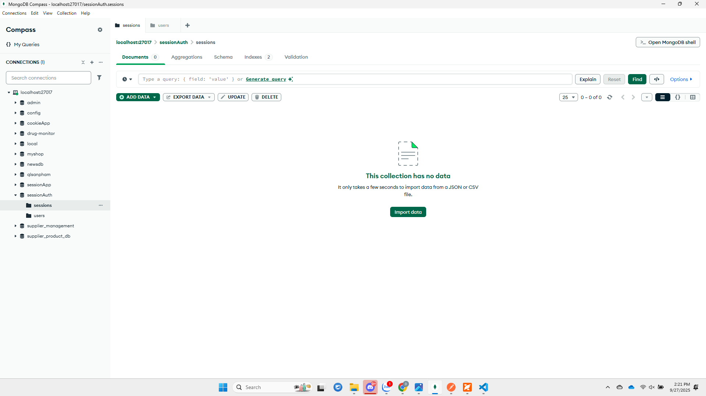
 "Logout successful!" 
- **Lỗi:**
  - Nếu session không tồn tại hoặc có lỗi khi xóa session
  - Trả về:
    ```json
    { "error": "Logout failed" }
    ```

## Các trường hợp lỗi cần kiểm thử
- Đăng ký với username đã tồn tại
- Đăng nhập với sai mật khẩu
- Truy cập profile khi chưa đăng nhập
- Đăng xuất khi chưa đăng nhập

## Liên hệ
Nếu có thắc mắc, vui lòng liên hệ qua email hoặc github của tác giả.